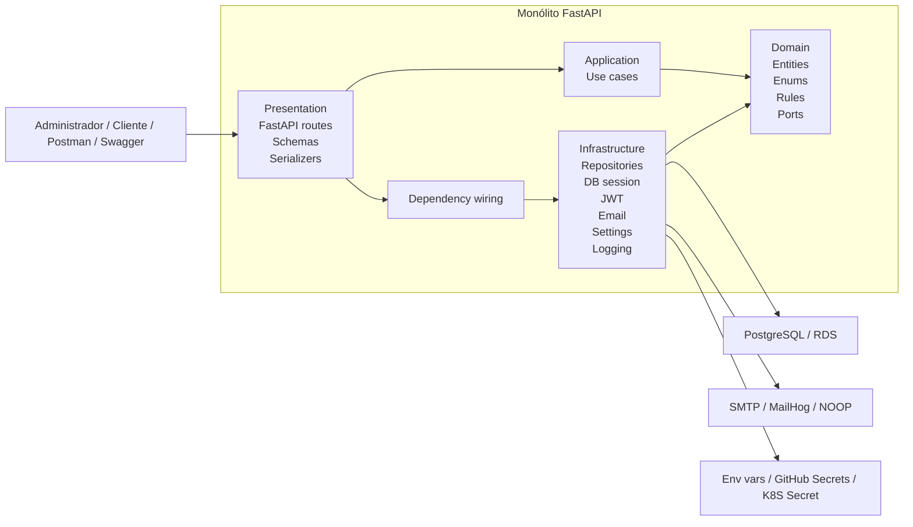
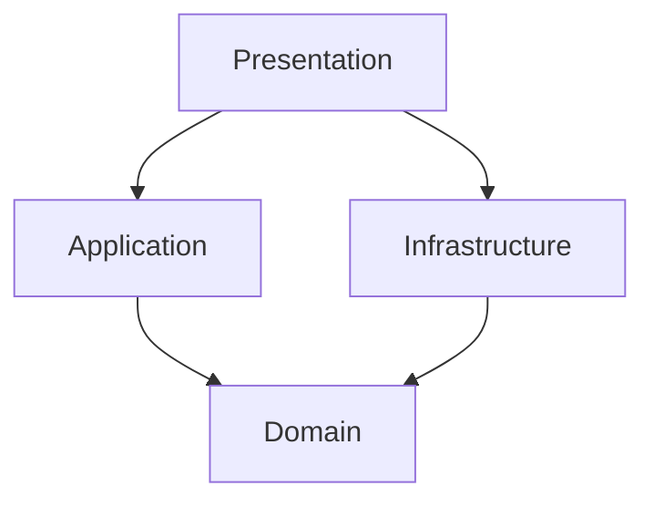
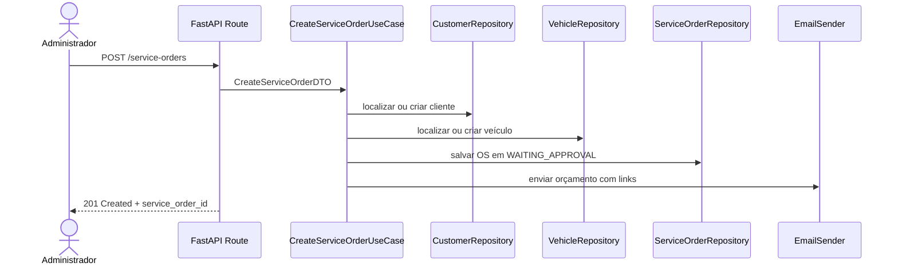
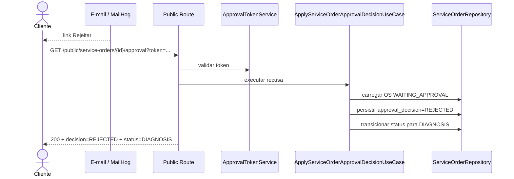
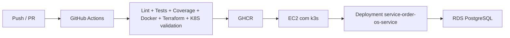

# Arquitetura da solução

## Visão geral

O sistema é um backend monolítico em FastAPI organizado em camadas inspiradas em Clean Architecture. A regra de negócio central é a gestão da ordem de serviço, incluindo abertura, orçamento, aprovação ou recusa e evolução operacional até entrega.

## Desenho visual das camadas

## Como os componentes se conversam

### Regra principal

- `presentation` recebe a requisição HTTP e valida o payload;
- `presentation` chama um caso de uso da camada `application`;
- `application` usa contratos definidos pelo `domain`;
- `infrastructure` implementa esses contratos e fala com banco, JWT e e-mail;
- `domain` concentra as regras de negócio e não depende de FastAPI, SQLAlchemy ou SMTP.

### Dependências entre camadas

- `presentation -> application`: orquestração dos casos de uso;
- `application -> domain`: regras, entidades e contratos;
- `infrastructure -> domain`: implementação de contratos;
- `presentation -> infrastructure`: somente para montagem de dependências.

## Fluxo principal de requisição

### Abertura da OS

### Recusa do orçamento por e-mail

## Fluxo da arquitetura limpa na prática

### Domain

- entidades: `ServiceOrder`, `Customer`, `Vehicle`, `CatalogService`, `InventoryPart`, `User`;
- enums: `ServiceOrderStatus`, `ApprovalDecision`;
- contratos: repositórios e serviços;
- regras centrais:
  - cálculo do orçamento;
  - transição de status;
  - aprovação e recusa do orçamento.

### Application

- encapsula os casos de uso;
- coordena persistência, autenticação e notificações;
- não conhece detalhes do framework HTTP.

Casos de uso centrais:

- autenticação e registro;
- CRUD de clientes, veículos, catálogo e peças;
- criação e consulta de ordens de serviço;
- aprovação e recusa do orçamento;
- atualização manual de status;
- métricas de tempo médio de execução.

### Infrastructure

- implementa repositórios com PostgreSQL;
- implementa autenticação JWT;
- implementa envio de e-mail via SMTP ou NOOP;
- concentra settings, segredos e logging.

### Presentation

- expõe as rotas FastAPI;
- valida request/response;
- traduz payload HTTP em DTOs e entidades serializadas.

## Decisões de modelagem relevantes

- a recusa do orçamento não cria `status=REJECTED`;
- o estado operacional da OS volta para `DIAGNOSIS`;
- a decisão do orçamento fica em `approval_decision=REJECTED`;
- isso separa claramente workflow da oficina de decisão comercial do cliente.

## Deploy e operação

### Pipeline

### Estratégia operacional

- local: `docker-compose.yml` com MailHog para demonstração do fluxo de e-mail;
- demo principal: `k3s` single-node em EC2;
- banco fora do cluster: RDS PostgreSQL;
- fallback preservado: deploy legado com Docker Compose.

