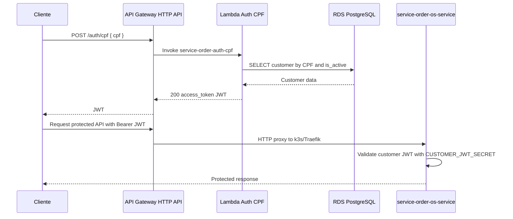

# Authentication Sequence

```mermaid
sequenceDiagram
  participant Client as Cliente
  participant APIGW as API Gateway HTTP API
  participant Lambda as Lambda Auth CPF
  participant RDS as RDS PostgreSQL
  participant API as service-order-os-service

  Client->>APIGW: POST /auth/cpf { cpf }
  APIGW->>Lambda: Invoke service-order-auth-cpf
  Lambda->>RDS: SELECT customer by CPF and is_active
  RDS-->>Lambda: Customer data
  Lambda-->>APIGW: 200 access_token JWT
  APIGW-->>Client: JWT
  Client->>APIGW: Request protected API with Bearer JWT
  APIGW->>API: HTTP proxy to k3s/Traefik
  API->>API: Validate customer JWT with CUSTOMER_JWT_SECRET
  API-->>Client: Protected response
```

