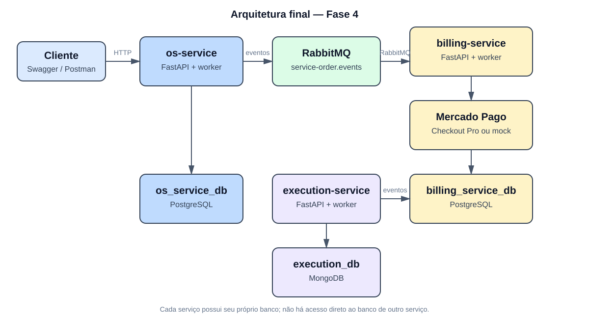

# Arquitetura final — Fase 4

Este documento descreve a arquitetura implementada no ecossistema de ordens de serviço e deve ser lido em conjunto com os READMEs dos três serviços.

## Diagrama geral



```text
flowchart LR
    Client[Cliente / Swagger / Postman] --> OS[os-service<br/>FastAPI]
    OS --> OSDB[(PostgreSQL<br/>os_service_db)]
    OS <--> MQ[RabbitMQ<br/>service-order.events]

    MQ <--> Billing[billing-service<br/>FastAPI]
    Billing --> BillingDB[(PostgreSQL<br/>billing_service_db)]
    Billing --> MP[Mercado Pago<br/>Checkout Pro ou mock]

    MQ <--> Execution[execution-service<br/>FastAPI + worker]
    Execution --> ExecDB[(MongoDB<br/>execution_db)]
```

Cada microsserviço é dono de seus dados. Não existe acesso direto de um serviço ao banco de outro; a integração ocorre por eventos RabbitMQ e por APIs HTTP para comandos/consultas específicas. Cada API possui também um worker que processa as mensagens da sua fila.

## Responsabilidade dos microsserviços

| Serviço | Responsabilidade | Persistência |
| --- | --- | --- |
| `os-service` | Identidade da OS, histórico, transições de status e orquestração da Saga. Também mantém clientes e veículos do seu contexto. | PostgreSQL (`os_service_db`) |
| `billing-service` | Criação do orçamento, aprovação, pagamento e integração com o gateway. | PostgreSQL (`billing_service_db`) |
| `execution-service` | Fila de execução, início, passos de diagnóstico/reparo, conclusão e falha. | MongoDB (`execution_db`), coleções `execution_jobs` e `processed_events` |

## Comunicação e fluxo principal

```text
sequenceDiagram
    participant C as Cliente
    participant OS as os-service
    participant R as RabbitMQ
    participant B as billing-service
    participant E as execution-service

    C->>OS: POST /service-orders
    OS->>OS: Persiste OS em QUOTE_REQUESTED
    OS-)R: OS_OPENED
    R-)B: OS_OPENED
    B->>B: Cria e persiste orçamento
    B-)R: QUOTE_CREATED
    R-)OS: QUOTE_CREATED
    C->>B: POST /quotes/{quote_id}/approve
    B->>B: Cria preferência de pagamento
    B-)R: QUOTE_APPROVED + PAYMENT_PREFERENCE_CREATED
    R-)OS: eventos de aprovação/pagamento
    C->>B: POST /payments/{payment_id}/sync
    B->>B: Consulta Mercado Pago ou mock
    B-)R: PAYMENT_CONFIRMED ou PAYMENT_FAILED
    R-)OS: resultado do pagamento
    OS-)R: EXECUTION_REQUESTED
    R-)E: EXECUTION_REQUESTED
    E->>E: Cria job e executa diagnóstico/reparo
    E-)R: EXECUTION_QUEUED / EXECUTION_STARTED / EXECUTION_COMPLETED
    R-)OS: eventos de execução
    OS->>OS: Marca COMPLETED ou falha compensatória
```

O `QUOTE_CREATED` é uma confirmação informativa: o `os-service` o aceita sem avançar o status. A aprovação efetiva ocorre pelo evento `QUOTE_APPROVED`. O endpoint de sincronização é o mecanismo atual de confirmação com Mercado Pago; as URLs de retorno do Checkout Pro são apenas de navegação e não confirmam pagamento.

## Estratégia Saga: orquestração

Foi escolhida Saga por orquestração, com o `os-service` como coordenador. A decisão se deve a três fatores:

- o estado global da OS já pertence ao `os-service`, tornando natural centralizar as transições;
- o fluxo fica explícito e auditável no histórico da OS;
- a demonstração e os testes BDD conseguem acompanhar uma única máquina de estados, sem regras circulares distribuídas entre consumidores.

O orquestrador não executa transações entre bancos. Ele reage a eventos, atualiza apenas o próprio PostgreSQL e publica o próximo comando/evento. Assim, cada etapa é localmente transacional e a consistência entre serviços é eventual.

### Estados e eventos

```text
OPENED -> QUOTE_REQUESTED -> QUOTE_APPROVED -> PAYMENT_PENDING
       -> PAYMENT_CONFIRMED -> EXECUTION_REQUESTED
       -> EXECUTION_IN_PROGRESS -> COMPLETED
```

Eventos principais:

| Evento | Produtor | Consumidor/efeito |
| --- | --- | --- |
| `OS_OPENED` | `os-service` | `billing-service` cria orçamento |
| `QUOTE_CREATED` | `billing-service` | `os-service` registra a confirmação |
| `QUOTE_APPROVED` | `billing-service` | `os-service` avança para orçamento aprovado |
| `PAYMENT_PREFERENCE_CREATED` | `billing-service` | `os-service` avança para pagamento pendente |
| `PAYMENT_CONFIRMED` | `billing-service` | `os-service` solicita execução |
| `PAYMENT_FAILED` | `billing-service` | `os-service` encerra como falha de pagamento |
| `EXECUTION_REQUESTED` | `os-service` | `execution-service` cria o job |
| `EXECUTION_QUEUED` | `execution-service` | evidência de enfileiramento |
| `EXECUTION_STARTED` | `execution-service` | `os-service` marca execução em andamento |
| `EXECUTION_COMPLETED` | `execution-service` | `os-service` marca OS como concluída |
| `EXECUTION_FAILED` | `execution-service` | `os-service` encerra como falha de execução |
| `OS_COMPENSATION_REQUIRED` | `os-service` | auditoria da falha/compensação |

Todos os eventos usam o envelope `{ event_id, event_type, correlation_id, occurred_at, payload }`. Os workers persistem `event_id` em `processed_events`; mensagens repetidas são ignoradas, garantindo idempotência durante retries.

### Compensações

- falha na criação do orçamento: `QUOTE_FAILED`;
- falha ou recusa do pagamento: `PAYMENT_FAILED`, sem solicitar execução;
- falha ao enfileirar: `EXECUTION_ENQUEUE_FAILED`;
- falha durante diagnóstico/reparo: `EXECUTION_FAILED`.

As compensações não fazem rollback distribuído. Elas registram o estado terminal da OS e publicam `OS_COMPENSATION_REQUIRED` para manter a decisão auditável.

## Justificativa da divisão e das tecnologias

### Divisão por contexto

- `os-service` concentra o ciclo de vida e a visão operacional da ordem, que é o agregado que coordena o processo.
- `billing-service` isola regras financeiras, estados de orçamento/pagamento e credenciais do provedor.
- `execution-service` isola o trabalho operacional, que possui evolução e volume diferentes do cadastro e do financeiro.

Essa divisão reduz acoplamento, permite deploy independente e impede que alterações de pagamento ou execução contaminem o modelo da OS. O custo é a necessidade de contratos de eventos, retries, idempotência e consistência eventual; esses mecanismos fazem parte da implementação.

### Tecnologias

- **Python + FastAPI:** APIs REST leves, Swagger integrado e boa separação entre apresentação, aplicação e domínio.
- **Clean Architecture:** regras de negócio independentes de FastAPI, RabbitMQ, SDKs e bancos; facilita testes com adapters em memória.
- **PostgreSQL + SQLAlchemy/Alembic:** adequado para OS, histórico, clientes, veículos, orçamentos e pagamentos, com consistência transacional e migrations.
- **MongoDB:** adequado aos jobs de execução e seus passos, cujo documento pode evoluir durante diagnóstico e reparo.
- **RabbitMQ:** entrega assíncrona dos eventos da Saga, desacoplando os serviços e permitindo workers, filas e retries.
- **Mercado Pago Checkout Pro:** integração de pagamento encapsulada por `PaymentGatewayPort`, com adapter real e fake determinístico para testes/demo.
- **Docker e Kubernetes/k3s:** mesma forma de empacotamento local e deploy de baixo custo na AWS Academy, com API e worker separados.
- **GitHub Actions, GHCR e Datadog:** automação de lint/testes/build/deploy, distribuição das imagens e observabilidade por logs correlacionados.

## Escopo deste repositório

Este repositório é o `os-service`. Ele implementa o agregado da ordem, o PostgreSQL `os_service_db`, o worker consumidor de Billing/Execution e o orquestrador da Saga. A documentação equivalente nos repositórios `service-order-billing-service` e `service-order-execution-service` mantém a mesma visão sistêmica, destacando o contexto de cada serviço.
