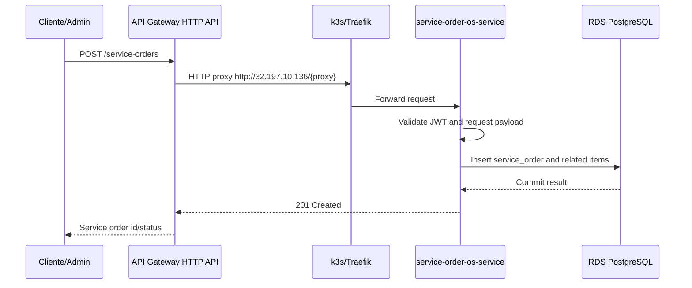

# Service Order Opening Sequence

```mermaid
sequenceDiagram
  participant Client as Cliente/Admin
  participant APIGW as API Gateway HTTP API
  participant Traefik as k3s/Traefik
  participant API as service-order-os-service
  participant RDS as RDS PostgreSQL

  Client->>APIGW: POST /service-orders
  APIGW->>Traefik: HTTP proxy http://32.197.10.136/{proxy}
  Traefik->>API: Forward request
  API->>API: Validate JWT and request payload
  API->>RDS: Insert service_order and related items
  RDS-->>API: Commit result
  API-->>APIGW: 201 Created
  APIGW-->>Client: Service order id/status
```

