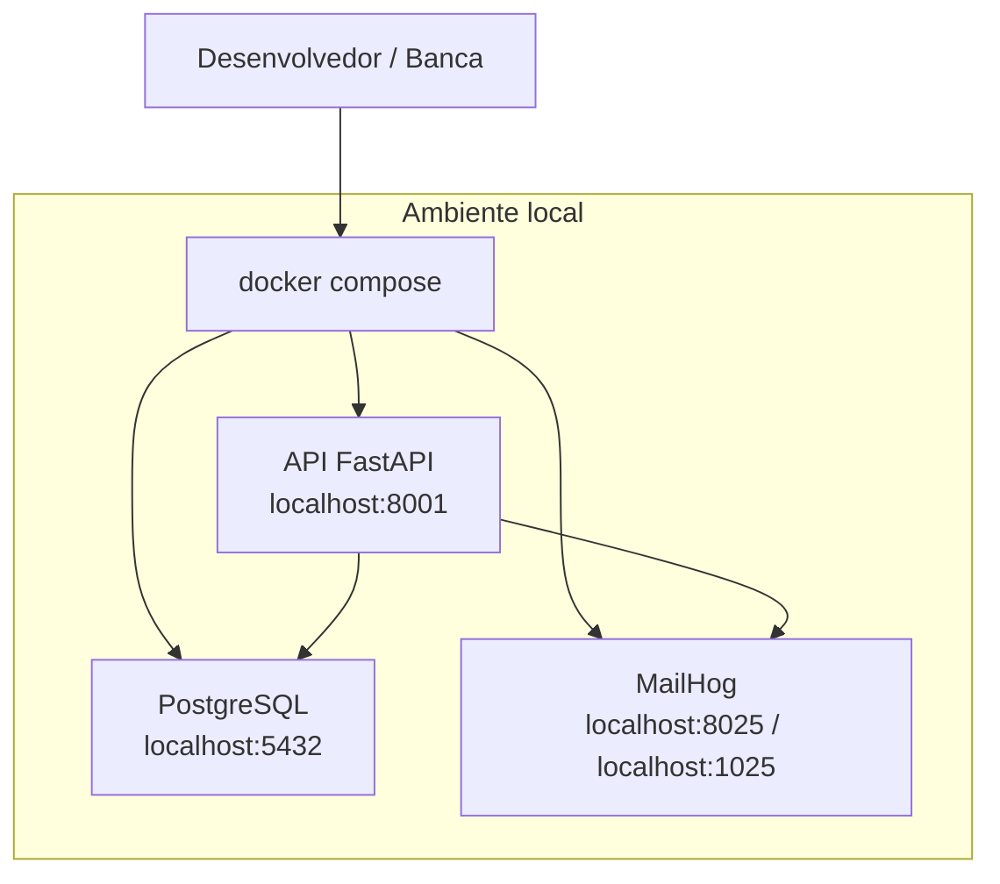
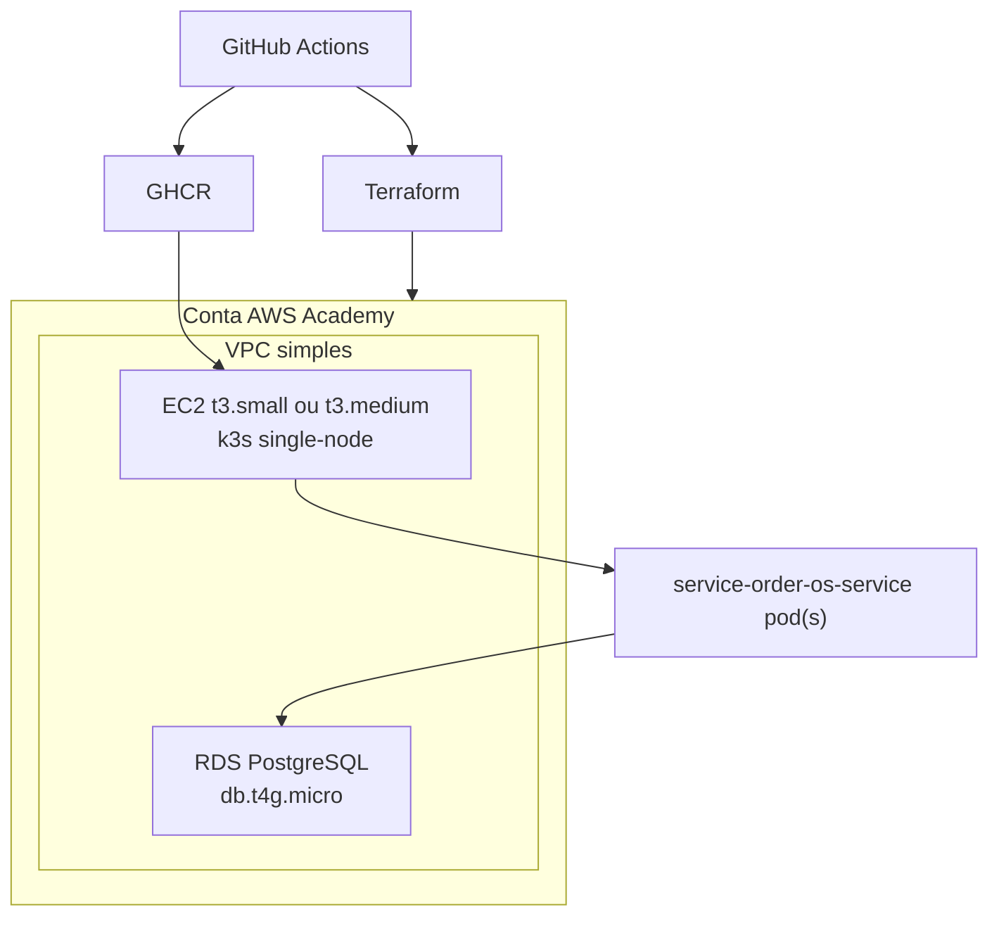
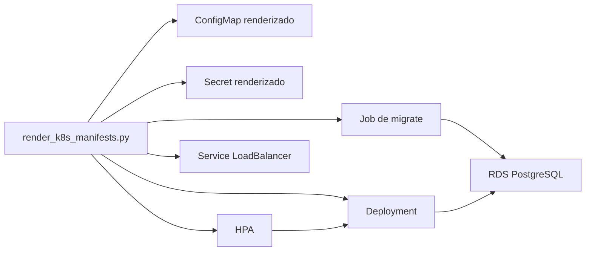

# Solution Architecture

## Plataforma local

### Objetivo do ambiente local

- desenvolvimento rápido;
- demonstração do fluxo de orçamento por e-mail;
- execução de testes funcionais com MailHog;
- smoke test do Compose.

## Plataforma de demonstração na AWS

### Componentes

- Terraform provisiona rede, EC2, security groups e RDS;
- `k3s` hospeda a API e o HPA;
- GHCR distribui a imagem da aplicação;
- GitHub Actions valida e publica os artefatos.

## Desenho do deploy em `k3s`

## Trade-offs assumidos

- `k3s` single-node prioriza custo e simplicidade;
- o HPA demonstra escalabilidade de pods, não de nós;
- o RDS fora do cluster melhora clareza arquitetural para a banca;
- GHCR evita adicionar um registry AWS extra na demonstração.

